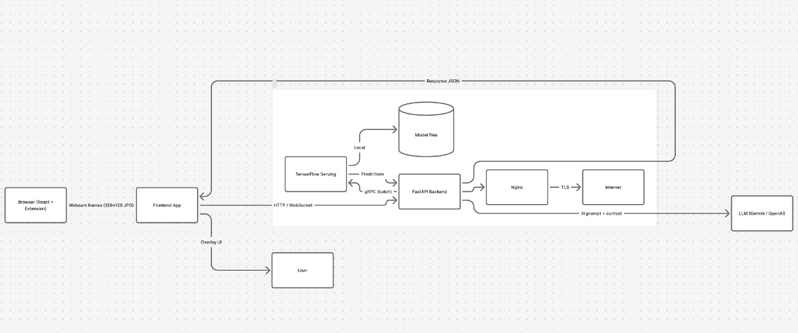
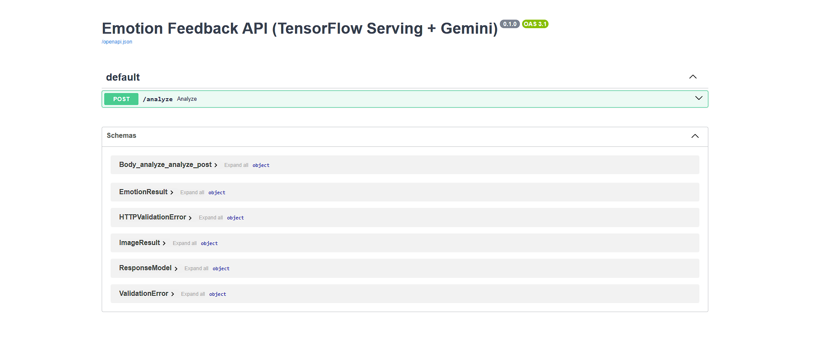
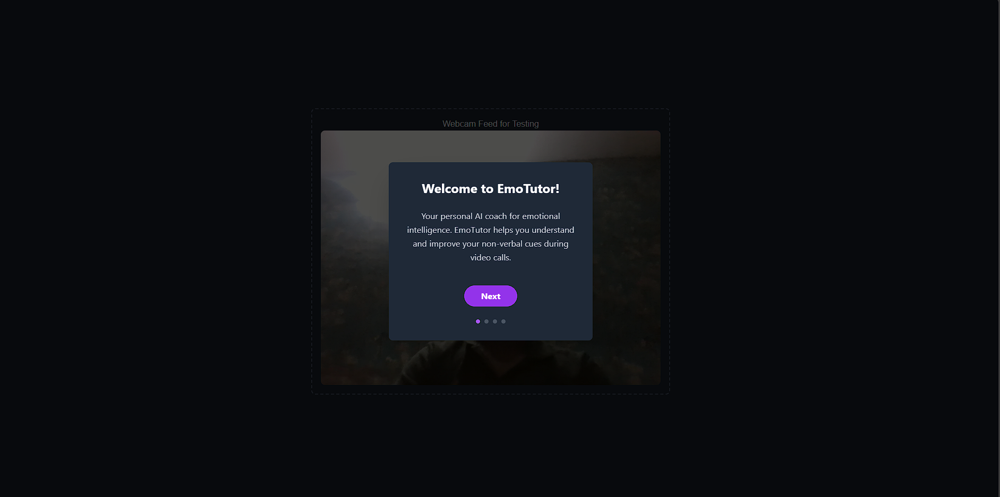
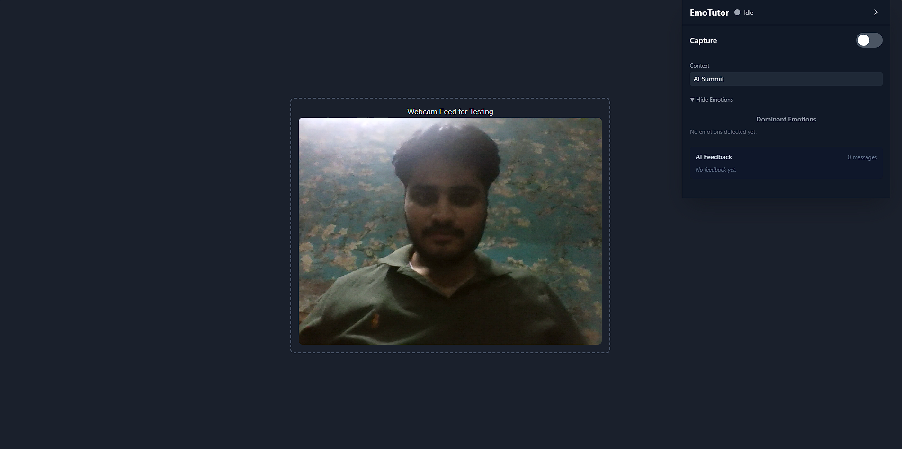
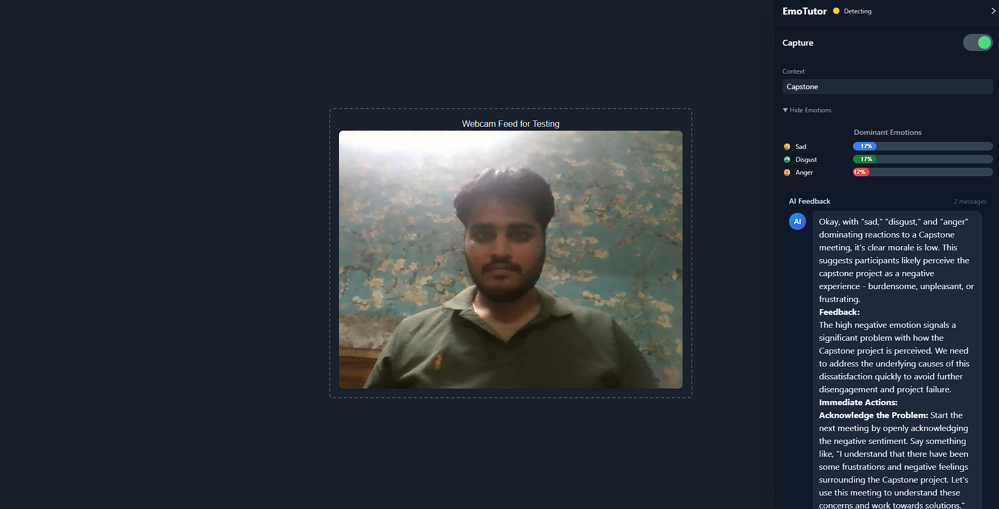

# 🌟 EmoTutor — Emotion Feedback & Analysis System

## 🧠 Overview

EmoTutor is a real-time emotion recognition and feedback system built as part of the *LPU Capstone — KC007* project. It leverages *computer vision, **TensorFlow Serving, and **FastAPI* to analyze user facial expressions and return emotional insights. A lightweight browser extension captures face frames and sends them to a backend for analysis.

The system is designed to be fast, reliable, and user-friendly, offering immediate emotion-based feedback for learning, mental-wellbeing insights, and context-aware interaction.

---

## 🚀 Live Project Resources

### 🧪 Model & Experiments

* *Kaggle Notebook:*
  👉 [https://www.kaggle.com/code/siddharthchandel08/hface-net](https://www.kaggle.com/code/siddharthchandel08/hface-net)

### 🎨 Frontend (Vercel)

* *Web App:*
  🚀 [https://emo-tutor.vercel.app](https://emo-tutor.vercel.app)

### 🛠 Backend (FastAPI + TF Serving)

* *Backend URL:*
  🔗 [https://hfacenet.duckdns.org/](https://hfacenet.duckdns.org/)

* *API Documentation:*
  📄 [https://hfacenet.duckdns.org/docs](https://hfacenet.duckdns.org/docs)

---

## 🏗 Tech Stack

### 🔹 Frontend

* React (Vite)
* Browser Extension support
* Real-time webcam face capture
* On-device face detection (YOLOv8 ONNX)
* Secure CORS-enabled communication

### 🔹 Backend

* FastAPI
* TensorFlow Serving (gRPC)
* Custom emotion classification model (HFace-Net)
* Load balancing & caching
* AWS-based deployment

### 🔹 Infrastructure

* EC2 instance hosting backend + TF-Serving
* Nginx reverse proxy
* SSL via DuckDNS & Certbot
* Vercel hosting for frontend

---

## 🧩 Features

* 🎭 Real-time face emotion recognition
* ⚡ Ultra-fast gRPC inference via TensorFlow Serving
* 📦 Lightweight 128×128 frame processing
* 🔒 Secure API communication
* 🖥 Extension-based overlay interface
* 💬 Detailed emotion probability scores

---

## 📁 Project Structure (Simplified)

* /frontend — React + Extension + UI
* /backend — FastAPI server and routing
* /model — TensorFlow SavedModel for TF Serving
* /scripts — Utility functions and deployment scripts

---

## 🛠 Setup Instructions

### 1️⃣ Backend

bash
git clone <repo>
cd backend
uvicorn main:app --host 0.0.0.0 --port 8000

Ensure TensorFlow Serving is running:

bash
tensorflow_model_server \
  --model_name=hface \
  --model_base_path=/path/to/model \
  --port=8500

### 2️⃣ Frontend

bash
cd frontend
npm install
npm run dev

### 3️⃣ Extension Build

bash
npm run build
zip -r extension.zip dist/

Install the zip in Chrome → Extensions → Load unpacked.

---

## 🎯 Use Case Examples

* Classroom engagement analysis
* Mental health application
* AI tutors & e-learning platforms
* Real-time feedback systems
* Customer emotion analytics

---

## 🏗 Architecture Diagram

Below is a high-level architecture diagram showing how EmoTutor components interact. You can render the flowchart on GitHub (Mermaid enabled) or use the provided architecture.png in the ./screenshots folder.

mermaid
flowchart LR
  Browser[Browser (React + Extension)] -->|Webcam frames (128x128 JPG)| Client[Frontend App]
  Client -->|HTTP / WebSocket| FastAPI[FastAPI Backend]
  FastAPI -->|gRPC (batch)| TFServing[TensorFlow Serving]
  TFServing -->|Predictions| FastAPI
  FastAPI -->|AI prompt + context| Gemini[LLM (Gemini / OpenAI)]
  FastAPI -->|Response JSON| Client
  Client -->|Overlay UI| User[User]
  subgraph Infra
    FastAPI --> Nginx[Nginx]
    Nginx -->|TLS| Internet[Internet]
    TFServing -->|Local| Disk[(Model files)]
  end

---

## 📸 Screenshots

> The repository already contains the screenshots in the ./screenshots folder. If you are copying images from a local machine or CI, use the filenames listed below.

*Files to include in* ./screenshots/:

* api-docs.png — API docs UI (from /mnt/data/e40595fe-1f95-4466-bbb8-0b93976e91e4.png)
* onboarding.png — Onboarding modal (from /mnt/data/3359d8c1-328c-47ac-a022-229570e34d8a.png)
* idle.png — Idle webcam state (from /mnt/data/434deba6-78cf-442d-a727-d268ae04c96e.png)
* detection.png — Detection + AI feedback panel (from /mnt/data/dc4dcf93-53d1-4e96-a288-04d40e1f9811.png)

Place those four images in the repo at ./screenshots/ (example: repo_root/screenshots/api-docs.png). Once added, the following Markdown will display them correctly on GitHub.

### 🔹 API Documentation UI

### 🔹 Onboarding Screen

### 🔹 Idle State

### 🔹 Detection & AI Feedback

---

## 👥 Authors

* *Vaishnavi Basutkar*
* *Siddharth Chandel*
* *Mrityunjay Gupta*
* *Abhinav Samkaria*
* *Pushpam*
* *Bhargavi Sharma*

---

## ⭐ Acknowledgments

Special thanks to *Lovely Professional University*, mentors, and test users who helped enhance EmoTutor.

---

## 📄 License

This project is part of an academic capstone and is intended for educational and research purposes.
